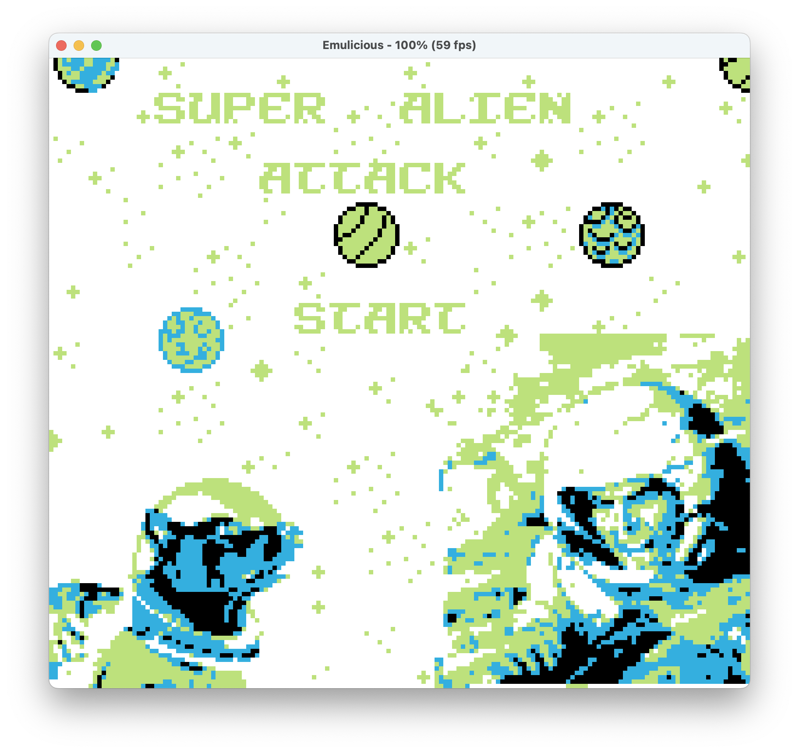
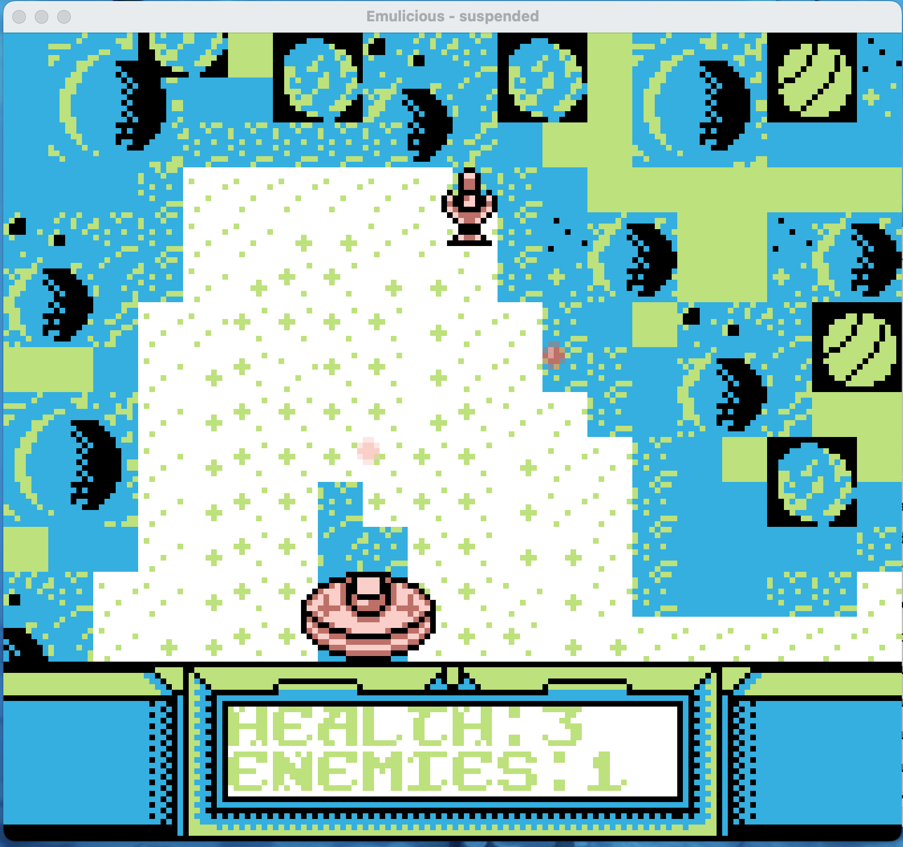
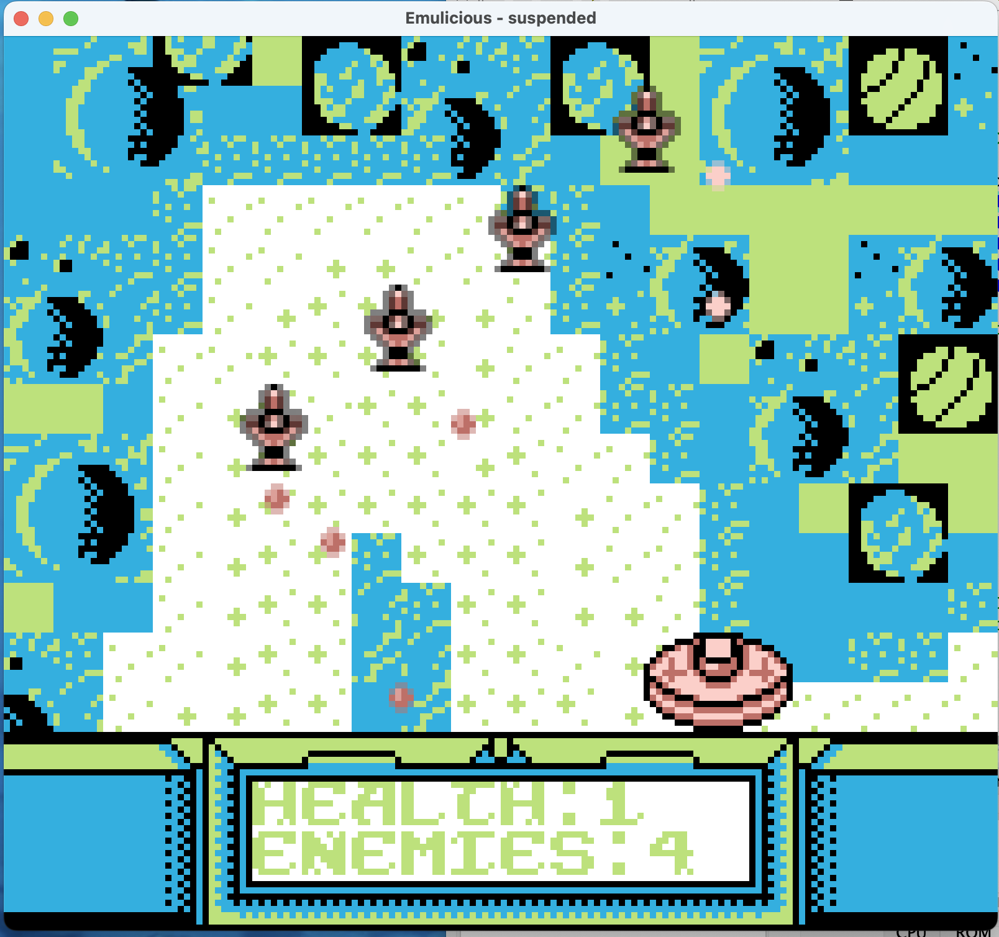
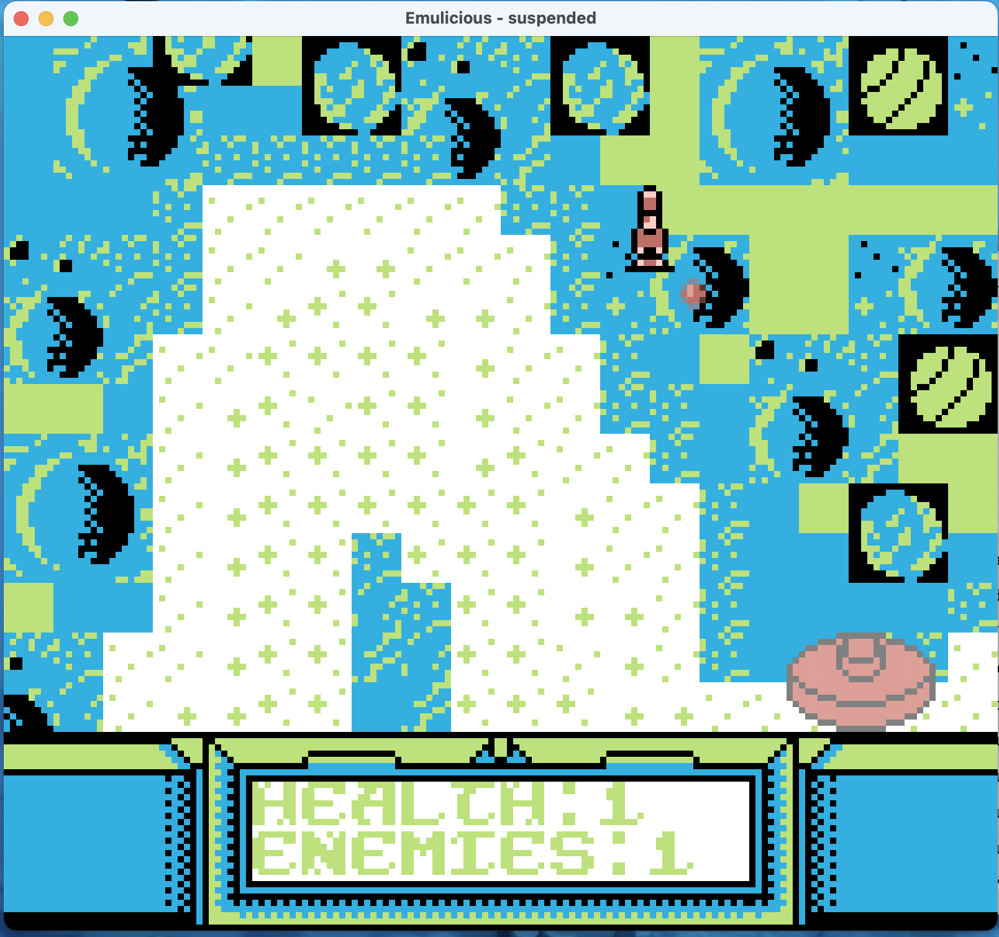
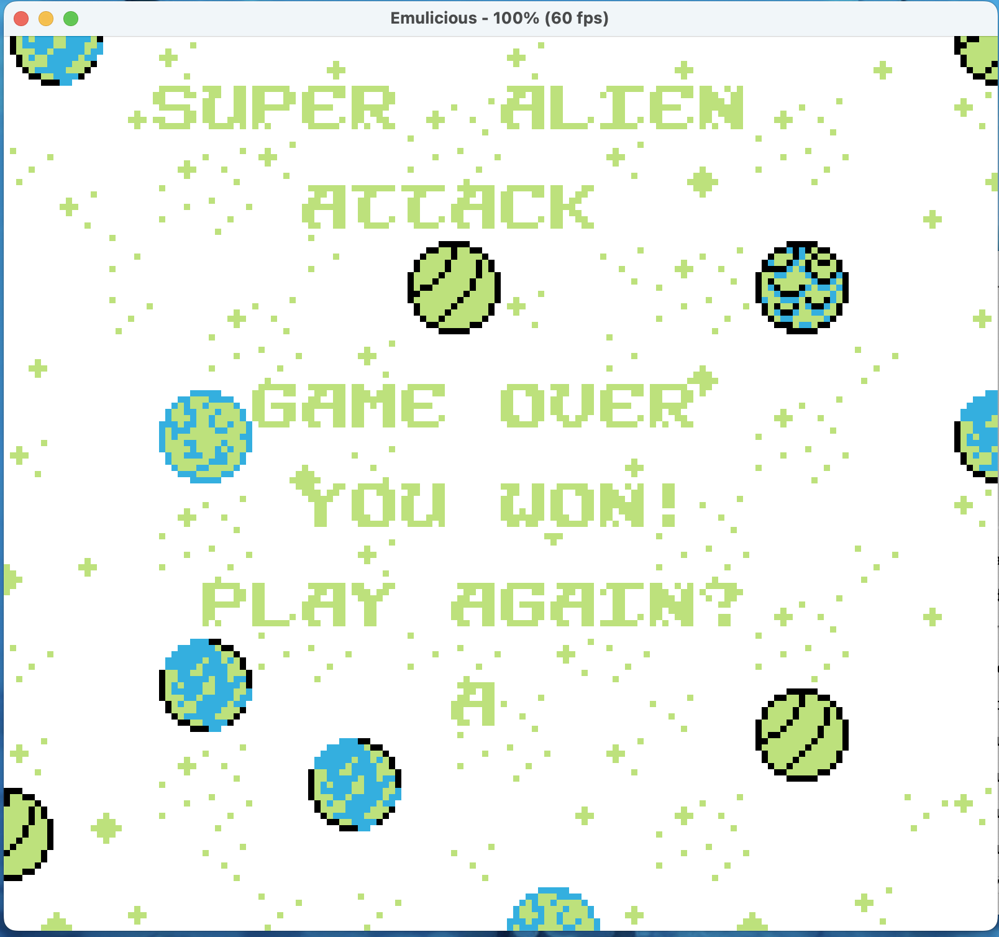
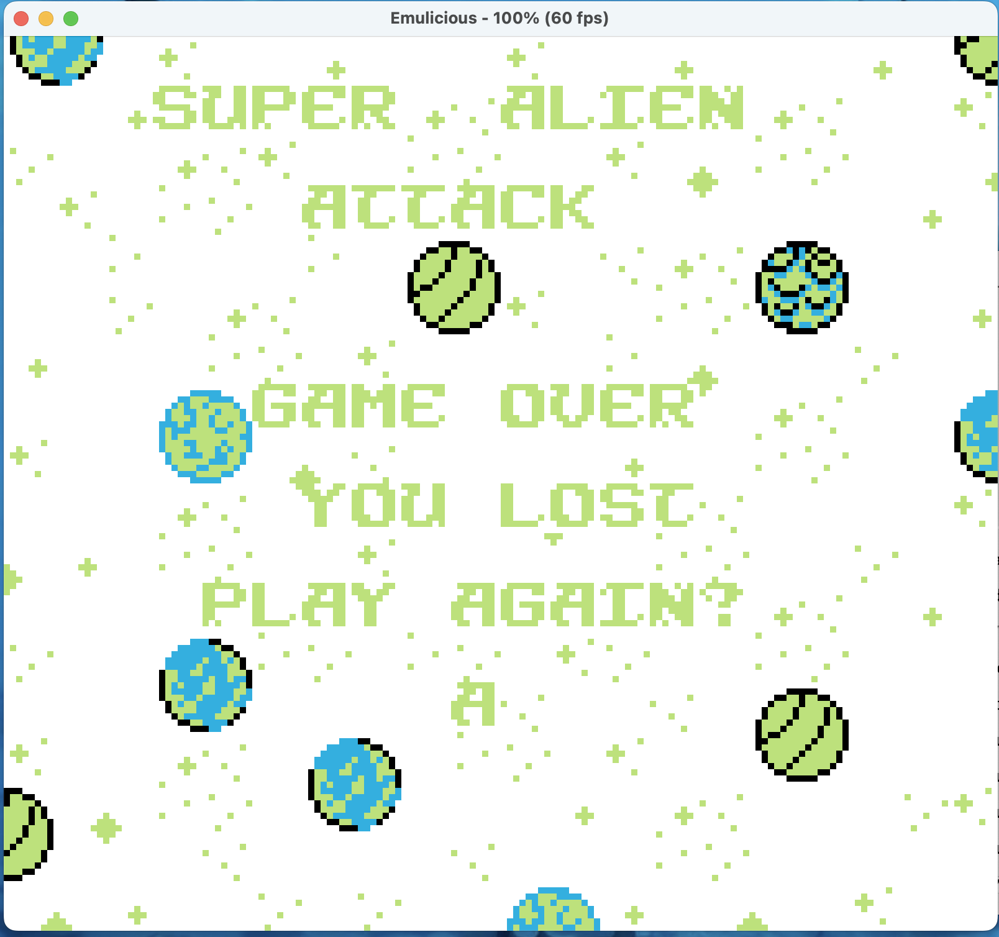

# CS 240 Game Boy Game

# Group Members
    Ashkan Khilwatgar
    Sasha Knoll

# License
    This project is licensed under the MIT license the link to which is 
        https://opensource.org/license/mit
    Third party assets and their licenses are listed in LICENSE.md under the assets folder

# Structure
game-ashkan_sasha
    assets
    audio
    build
    include
    src
    tools
    instruction_images
    makefile
    README.md

## Installation
1. Clone the repository and stay on game-ashkan_sasha directory ("clone with git clone https://github.com/cs240-fall2025/game-ashkan_sasha.git")
2. Build with make, this will create a gb file
3. Insert the .gb file into an emulator of your choice
4. Enjoy!

# Game Rules
    1. Press Start to begin game
    

    2. Press A to shoot a missile (levels 1, 2, 3)
    

    3. Press B to shoot another missile (level 3)
    

    4. Avoid enemy missiles or you will lose a life
    

    5. You only have 3 lives

    6. Hit an enemy with your missile to kill it (levels 1 and 2)

    7. Hit an enemy with your missile twice to kill it (level 3)

    8. Kill all the enemies, without dying, to move on to the next level or to win the game if you beat level 3
    
    
    9. If you die or win the game press A to restart from level 1
    